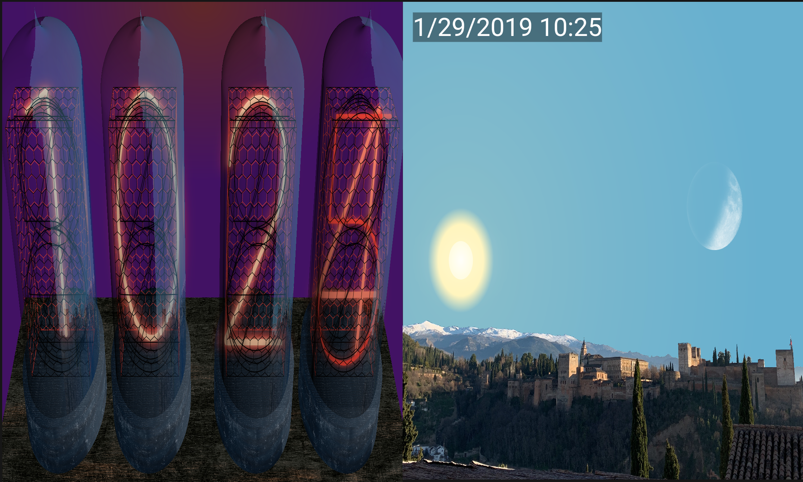
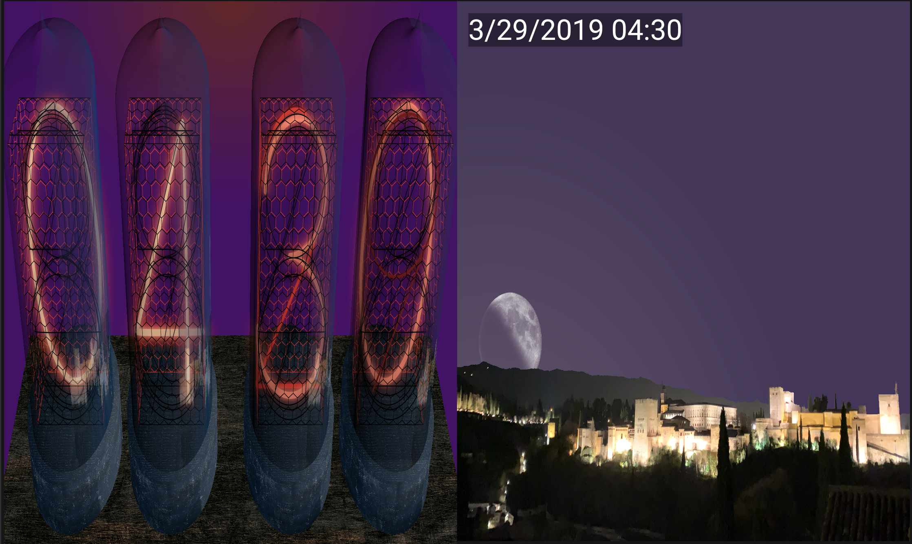
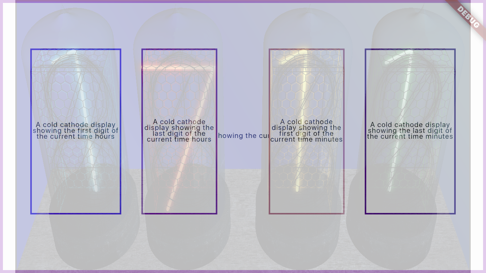

# Sunset Reflections Clock
A cold cathode display clock with a subtle reflection of a beautiful view in Spain: el Mirador de San Nicolás. The reflection shows the current position of the moon and the sun in the place where the picture was taken.

## Description

*Sunset reflections* is a face clock implemented for the [Flutter Clock Challenge](https://flutter.dev/clock) that emulates the behaviour of [cold cathode displays](https://en.wikipedia.org/wiki/Nixie_tube). These displays were a variant of neon lamps that resembled vacuum tubes and became popular between the sixties and the seventies. Shortly later they were superseded by LEDs and vacuum fluorescent displays. Recently, there is a new trend that has revived this kind of clocks and new models can be acquired at many popular online stores.

The clock face shows a perspective view that allows to observe the content of the tube displays: a set of stacked digits made with a thin tube filled with gas that glows when voltage is applied. The stacked digits are surrounded with a metallic hexagonal grid.

The glass tube shows a subtle reflection of a window to the [Mirador de San Nicolas](https://www.google.com/maps/place/Calle+Mirador+de+San+Nicol%C3%A1s,+18010+Granada/@37.1810461,-3.5924338,3a,75y,90t/data=!3m8!1e2!3m6!1sAF1QipPlkwj821uUKclf2Sjs_RYrPY6mqYQlN7wSSHdB!2e10!3e12!6shttps:%2F%2Flh5.googleusercontent.com%2Fp%2FAF1QipPlkwj821uUKclf2Sjs_RYrPY6mqYQlN7wSSHdB%3Dw203-h135-k-no!7i3613!8i2418!4m5!3m4!1s0xd71fcc7c961238b:0xe0cb79755e1ffe96!8m2!3d37.1812123!4d-3.5924667). This is one of the most iconic viewpoints in my hometown, Granada (Spain), which offers its visitors a fantastic view to the two most emblematic symbols of this beautiful town: the Alhambra, a wonderful muslim castle, and the Veleta, the second highest peak in the mountain range of Sierra Nevada. Former U.S. President [Bill Clinton](https://en.wikipedia.org/wiki/Bill_Clinton) once coined it _“the most breathtaking sunset in the world"_.

## Features

### 3D rendering

One of the most challenging parts during the development of this clock was achieving a realistic representation of the glass tubes. Somehow, I ended up developing a basic 3D rendering engine, able to represent triangle meshes (the glass tube, the tube stand and the table) and canvas paths (the grid and the digits) according to the position of a virtual camera (see [lib/basic3d](sunset_reflections_clock/lib/basic3d)).

Triangle meshes have been created with openScad (see [docs/tube.scad](docs/tube.scad)) and exported to [STL format](https://en.wikipedia.org/wiki/STL_(file_format)) (see [assets/3d](sunset_reflections_clock/assets/3d)). A binary STL parser has been implemented.

Paths have been created programmatically (in the case of the grid) or with the help of [inkScape](https://en.wikipedia.org/wiki/Inkscape) and exported to [SVG format](https://en.wikipedia.org/wiki/Scalable_Vector_Graphics) (in the case of digits). A very basic SVG parser has been implemented with the help of [path_drawing](https://pub.dev/packages/path_drawing).

The project took a lot of maths and headaches: calculations of the impact of the light on objects ([textures.dart](sunset_reflections_clock/lib/basic3d/textures.dart)), mapping to image textures ([uvmappers.dart](sunset_reflections_clock/lib/basic3d/uvmappers.dart)) or translation from clip coordinates to canvas coordinates ([clip_coordinates.dart](sunset_reflections_clock/lib/basic3d/clip_coordinates.dart)).

### Light and dark themes

The clock includes both light and dark themes. In fact, it is prepared to include multiple themes where different settings might be changed with little effort (see [lib/themes.dart](sunset_reflections_clock/lib/themes.dart)).

-   The light theme is more colourful and shows a clock whose digits have Google-ish colors on a light wood table.

-   The dark theme is a more old-fashioned style with more realistic colors for the digits on the top of a dark wood table.

### The sun and the moon

The sun and the moon appear in the reflection depending on the time and day. I've chosen to paint them using unrealistic big proportions for a more artistic effect, but their positions are indeed computed according to their real locations in real time at the place where the pictures were taken. This is done with the help of [flutter_suncalc](https://pub.dev/packages/flutter_suncalc). The [celestial coordinates](https://en.wikipedia.org/wiki/Celestial_coordinate_system) are then mapped to the picture provided a reference line of the horizon, the azimuth and the east and west of the [ecliptic](https://en.wikipedia.org/wiki/Ecliptic). This information is included in a json asset file (see [desc.json](sunset_reflections_clock/assets/sights/san_nicolas/desc.json)) in order to include other pictures in the future.

I did not consider the possibility of using the geo-position of the clock itself, since it seems that Lenovo Smart Clock does not have a GPS included and network calls were not allowed according to contest rules.

The phase of the moon is computed and displayed as well. This is again possible thanks to [flutter_suncalc](https://pub.dev/packages/flutter_suncalc), a port of [suncalc](https://github.com/mourner/suncalc) to Dart:

I have included a **test mode** that splits the screen into two columns and enables going back and forth in time using swipe gestures. _This feature has been included merely to show the operation of the clock. I'm aware is not be considered in the evaluation of the work presented._ To use it, just modify the value of the boolean constant `testMode` in [lib/main.dart](sunset_reflections_clock/lib/main.dart).

In addition to this, the class [ChangeNotifierProvider](sunset_reflections_clock/lib/time_notifier.dart), which takes care of notifying widgets of time changes, includes an optional parameter to make time run faster. During the tests I used to have the time running 1 minute every other second. For this, just change the value of the constant `timesFaster` in the file (libs/main.dart).

### The sky and the city lights

The sky illumination and its colors depend on the position of the sun, providing a fluent transition between night, day, sunrise and sunsets.

The illumination of the city and the [Alhambra](https://en.wikipedia.org/wiki/Alhambra), the fortress that can be seen in the view, is the result of the combination of two pictures taken from the exact same place at day and night, where they sky has been removed to be replaced by canvas gradients (see the gimp file [san-nicolas.xcf](docs/san-nicolas.xcf) and the file [sight.dart](sunset_reflections_clock/lib/clock_parts/sight.dart)).

### Accessibility and internationalization

Semantic nodes have been added. The top one describes the time with a short label as description. Four additional ones provide information of each vacuum tube. Their position correspond to the projection of each 3D object in the canvas:

Those labels are internationalized with the help of the [intl](https://pub.dev/packages/intl) package, though only English variations of the text have been included.

### Customizations

The clock is prepared to enable some additional customizations (see [lib/themes.dart](sunset_reflections_clock/lib/themes.dart)):

-   The colors of the digits
-   The size of some elements
-   The materials of the table and tubes stands
-   The position of the camera
-   ...
    

### Performance

This was challenging indeed! I've managed to keep GPU + UI time around 16/17-ish ms per frame (during the animation of the cathodes) with the exception of some puntual peaks. These peaks are caused by the refresh of the reflection image. For this reason, this action is delayed to happen a few seconds after a change of minute / hour. This way, it does not interfere with the animation.

Performance tests have been done on an IPhone 6.

### Flickering cathodes

The material used in the making of this clock is old technology. For this reason, the illuminated digits flicker. Don't worry, they are still completely reliable 😀.

### 12-hour / 24-hour format

For sure! That was not hard.

## License and author

All the source code and assets have been written by the author and are released under the [APACHE 2.0 license](LICENSE) with the exception of:

-   The image of the moon ([full-moon.png](assets/sights/san_nicolas/full-moon.png)) is the fantastic picture by [Luc Viatour](https://Lucnix.be), downloaded from [https://commons.wikimedia.org/wiki/File:Lune_ico.png](https://commons.wikimedia.org/wiki/File:Lune_ico.png) and is licensed under [CC BY-SA 3.0](https://creativecommons.org/licenses/by-sa/3.0/deed.en) license. No modifications have been done to the original file.

-   All the textures under [assets/textures](assets/textures) have been downloaded from the awesome [https://cc0textures.com/](https://cc0textures.com/) and are licensed under the [Creative Commons CC0](https://creativecommons.org/publicdomain/zero/1.0/deed.en) license.

-   The code under [flutter_clock_helper](flutter_clock_helper/), which are the two helper classes provided for the contest with a minor modification to show the test mode.

## Future improvements

This was my very first project using Flutter and Dart. It was a lot of fun but time flew faster than I expected. So, some of the initial ideas had to be discarded to deliver in time, but they could be added in a future:

-   Weather conditions! The idea was to add clouds, storm, fog and rain effects to the reflected image depending on the weather condition.
-   Additional sights: I would love to add pictures from famous places. It just requires taking a good picture from the very same spot at night and day (and some tweaking with Gimp). I look forward to contributions from people around the world in the future. I'd love to include a picture of Manhattan from the Brooklyn Bridge!
-   Shadows and better lightning.
-   UV Maps, reflection maps and some more advanced texture techniques could be implemented. Possibly adding the capability of importing some more advanced formats like [OBJ](https://en.wikipedia.org/wiki/Wavefront_.obj_file) so that the hard part of the rendering could be done in external tools like [Blender](<https://en.wikipedia.org/wiki/Blender_(software)>).
-   Code cleaning and reorganization. Indeed, the code needs documentation and it could use a good reorganization. I have started the reengineering of the 3D engine but did not make it on time for the contest.
